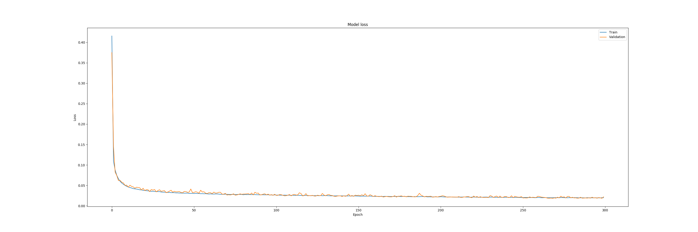
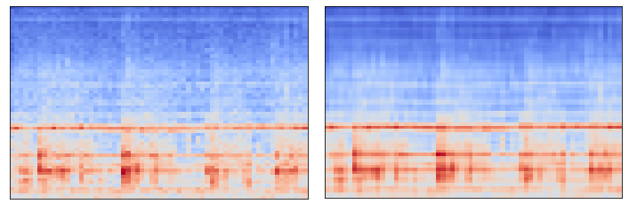
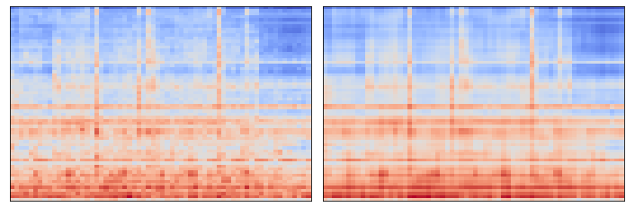

# Unsupervised Detection of Anomalous Sounds for Machine Condition Monitoring

## Introduction 

We decided to make a implementation that tackles the task of the dcase2020 Challenge task 2. Unsupervised Detection of Anomalous Sounds for Machine Condition Monitoring [1]. Simply put we want to detect anomalies from audio data escpecially from machine sounds. This would be very beneficial for autonomous monitoring of machines. The most common way to approach this is by using autoencoders which are neural networks used to learn the compressed representation of raw data and then reconstruct it into the original data aka the output. Since it can be hard to find samples to cover all anomalious sounds, an autoencoder is a very powerful tool to detect anomalies since it can be trained with only working machine sounds then it tries to reconstruct the data into an output. Then we can assign an anomaly score to the output based on the difference between the input and output. Since if the audio contained anomalies the autoencoder won't reconstruct it as well as a nonanomalious audio thus achieving a high anomaly score. Then we just need to set a good threshold to catch all audio samples with high anomaly scores. 

The dataset we will be using is the dataset provided in the challenge [2,3]. It contains the development data set with 6 different machines each that have 3-4 different machine ID:s. Each machine ID dataset contains about 1000 samples of normal sounds for training and 100-200 samples of normal and anomalous sounds for testing. Then there is the Evaluation dataset contains 400 samples for different machine ID:s that don't contain the condition label (normal or anomaly) and the machine ID:s are different then the development datasets. This data we cannot use because we won't know the condition of the machine in the data. Additionally there are 1000 normal samples for all machine ID:s in the evaluation dataset in an additional training dataset that we can use for training our model.

Finally we will introduce the baseline model that is given in the dcase challenge before we go to our approach [4]. The baseline model is a simple autoencoder where we assume it cannot reconstruct any sounds not used in training. The baseline first calculates the log-mel-spectrogram of the input with respect to the number of mel-filters and time-frames we want. We ended up going with 64 mels and 5 time frames since those seemed like good baseline values. Then the model concatenates several log-mel-filterbank outputs to get the acustic features at each time t. The architechture of the baseline model is very simple, it simply has an input shape of 640 then 4 dense layers with 128 units followed by a "bottleneck" layer which is a dense layer with 8 units and then 4 more dense layers with 128 units, finally we have an output layer that returns the same shape as the input with a dense layer of 640 units. For the baseline we used 100 epochs with a batch size of 512 and an Adam optimizer with 0.001 learning rate. The results of our baseline model can be seen in the section Experiments and results.

## Methodology

Inspired by the usage of convolutional autoencoders in image generation and noise removal [5], we implemented a convolutional autoencoder to reconstruct audio samples similarly as the baseline implementation. Usually image generation solutions are using variational autoencoders, but in outlier detection setup, controllable latent space do not provide any extra capabilities. So we deciced to stick with simple convolutional autoencoders that has convolutional layers with stride in encoder to reduce the size of the image and transpose convolution with stride in decoder to upsample the size back to original. We adopted the use of mean squared error as loss function in training and also in calculation of anomaly score. A brief experiments with binary crossentropy combined with KL-divergence inspired by [5] were made as loss function and measure of outlier with poor improvements to results.  

We considered log-mel-spectrograms as input images to our network. The dimensionality of the spectrograms was 64x64 and to get the 10 s input audio with sampling rate of 16 kHz clips transformed to spectrograms we therefore used $n_{mel}=64, n_{fft}=4096$ and $\text{hop_lenght}=2500$. The reduction of information in temporal domain is significant due to rather large $n_{fft}$ and hop_lenght but it usually can present the outliers of the test data well as presented in conclusions section. We also normalize the spectrograms to zero mean and variance of 1 to regularize the outputs of layers and get better drop the initial loss. Naturally, the channel number in spectrograms in 1 so the input size to network is (64,64,1).

The specific architecture of our network is as follows:

| Layer Type         |	Output Shape   | Num Parameters |
|--------------------|-----------------|----------------|
| Conv2D             | (32, 32, 32)    |	320  |
| BatchNormalization | (32, 32, 32)    |	128  |
| Conv2D             | (16, 16, 64)    |	18496|
| BatchNormalization | (16, 16, 64)    |	256  |
| Conv2D             | (8, 8, 64)      |	36928|
| BatchNormalization | (8, 8, 64)      |	256  |
| Conv2D             | (4, 4, 128)     |	73856|
| BatchNormalization | (4, 4, 128)     |	512  |
| Conv2DTranspose    | (8, 8, 64)      |	73792|
| BatchNormalization | (8, 8, 64)      |	256  |
| Conv2DTranspose    | (16, 16, 64)    |	36928|
| BatchNormalization | (16, 16, 64)    |	256  |
| Conv2DTranspose    | (32, 32, 32)    |	18464|
| BatchNormalization | (32, 32, 32)    |	128  |
| Conv2DTranspose    | (64,64, 1)      |	289  |
| BatchNormalization | (64,64, 1)      |	4    |

We implemented a kernel size of 3 to all convolutional and transpose convolutional layers and use stride 2 with padding='same' and Rectified Linear as activation across all layers. In total the model has 259 971 trainable parameters with is similar with the baseline implementation of the dcase task authors [4]. Note that parameters of the batch normalization layers are not count as trainable parameters because those are not optimized via gradient descend. 

As observable from table we adopted a symmetric architecture to our autoencoder where channel number and therefore also the number of parameters is similar in encoder and decoder parts of the network, but in reverse order. We noticed that the symmetry is essential to get the network to learn anything.

## Experiments and results 

The networks were trained for each of the machine variants separately like the baseline model. It took around 3 seconds per epoch and we trained the model for 300 epochs where the validation loss seemed to have stabilized. 

*Figure 1: Validation loss of the pump model.*

After training all of the models for 300 epochs, we tested them against the reference implementation and got results shown in table 1.

| Machine     | Our average AUC (area under curve)(%) | Reference AUC     (%) | Our average pAUC (partial area under curve)(%) | Reference pAUC    (%) |
|:------------|:--------------------------------------|:----------------------|:-----------------------------------------------|:----------------------|
| ToyCar      | 0.6044265804949768                    | 0.7904188209589154    | 0.5115495643052743                             | 0.6770448312032225    |
| ToyConveyor | 0.5444705502807206                    | 0.7219788686305358    | 0.49855999035735615                            | 0.6075683975761338    |
| fan         | 0.4858796775804515                    | 0.6787375350710187    | 0.5057930255883372                             | 0.528149808442621     |
| pump        | 0.5349788445788446                    | 0.729651795872384     | 0.5391974991510595                             | 0.6126229778783958    |
| slider      | 0.7009784644194756                    | 0.8484831460674158    | 0.6669500295683028                             | 0.6689089296274394    |
| ToyCar      | 0.4037878151260505                    | 0.6791734943977591    | 0.5137079831932773                             | 0.5073271413828689    |

As you can see from the results, the reference implementation detects anomalies better than our implementation. To our understanding, the network does not really seem to be compressing/decompressing the log-mel-spectogram anomalous samples worse than the normal samples. This means that our AUC and pAUC -values are quite close to the random estimator. In the testing dataset the number of samples for anomalies and normal samples is approximately 50% and our result of approximately 50 % seems to be just randomly picking samples and declaring them as anomalies and non-anomalies.
The only exception to this is the slider-dataset which has about 70% AUC, but the dataset itself is biased having about 69% of the samples as anomalies which is basically exactly what a random estimator would get if it always guessed everything to be anomaly.

## Conclusions

We have our code publicly available in repository[6].Here are some original and reconstructed spectrograms from our models. 

*Figure 2: Original log-mel-spectrogram on left and reconstruction of model in right of anomalious sample. First row is pump with id 0 and second row Toycar with id 3.*

As we can see the models have learned to reconstruct also the anomalous samples even thought those are unseen in training. This yields poor results because the normal and anomalous samples can't be differentiated based on mean squared error. 

One reason that might cause the model to learn also to reconstruct the anomalious samples is that the convolutional models are more effective to learn the local structures in spectrogram. This leads to model that is capable of producing overall shapes that are unseen based on the local features. The independent features of anomalies like vertical lines or bright dots are still visible in some training data samples where the convolutional kernels are able to learn to construct those.

To summarize our work, a convolutional autoencoder might be a too capable of learn to reconstruct the local areas in spectrogram and therefore is not suited well for audio anomaly detection from log-mel-spectrograms. Eventhough the results of our implementation were poor, we gain some valuable knowledge of anomaly detection using deep learning methods, implementing/training/evaluating models with keras and introduced ourselfes to Dcase.

## References
The dcase challenge page:

[1] Dcase URL:https://dcase.community/challenge2020/task-unsupervised-detection-of-anomalous-sounds#baseline-system

[2] Yuma Koizumi, Shoichiro Saito, Hisashi Uematsu, Noboru Harada, and Keisuke Imoto. ToyADMOS: a dataset of miniature-machine operating sounds for anomalous sound detection. In Proceedings of IEEE Workshop on Applications of Signal Processing to Audio and Acoustics (WASPAA), 308–312. November 2019. URL: https://ieeexplore.ieee.org/document/8937164.

[3] Harsh Purohit, Ryo Tanabe, Takeshi Ichige, Takashi Endo, Yuki Nikaido, Kaori Suefusa, and Yohei Kawaguchi. MIMII Dataset: sound dataset for malfunctioning industrial machine investigation and inspection. In Proceedings of the Detection and Classification of Acoustic Scenes and Events 2019 Workshop (DCASE2019), 209–213. November 2019. URL: http://dcase.community/documents/workshop2019/proceedings/DCASE2019Workshop_Purohit_21.pdf.

[4] Yuma Koizumi, Yohei Kawaguchi, Keisuke Imoto, Toshiki Nakamura, Yuki Nikaido, Ryo Tanabe, Harsh Purohit, Kaori Suefusa, Takashi Endo, Masahiro Yasuda, and Noboru Harada. Description and discussion on DCASE2020 challenge task2: unsupervised anomalous sound detection for machine condition monitoring. In Proceedings of the Detection and Classification of Acoustic Scenes and Events 2020 Workshop (DCASE2020), 81–85. November 2020. URL: http://dcase.community/documents/workshop2020/proceedings/DCASE2020Workshop_Koizumi_3.pdf.

[5] Francois Chollet, Building Autoencoders in Keras, 2016, https://blog.keras.io/building-autoencoders-in-keras.html

[6] Our github repository, https://github.com/juha-ylikoski/dcase2020_task2

